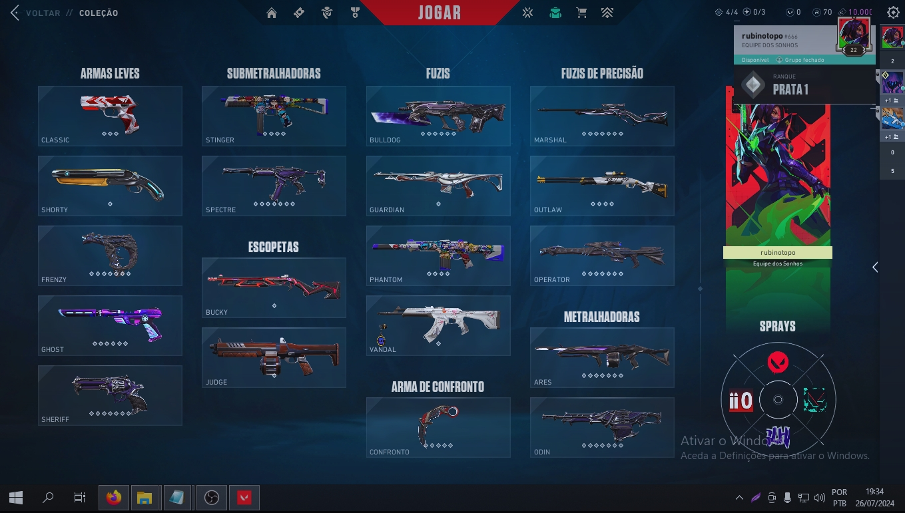
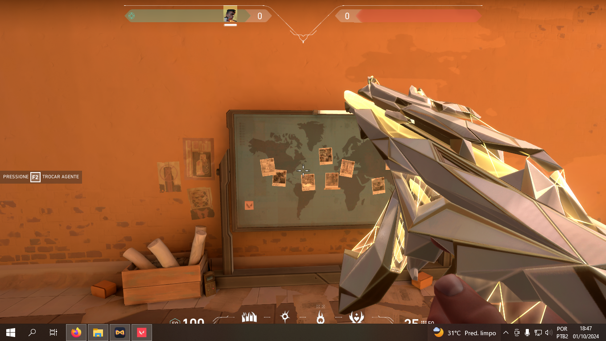
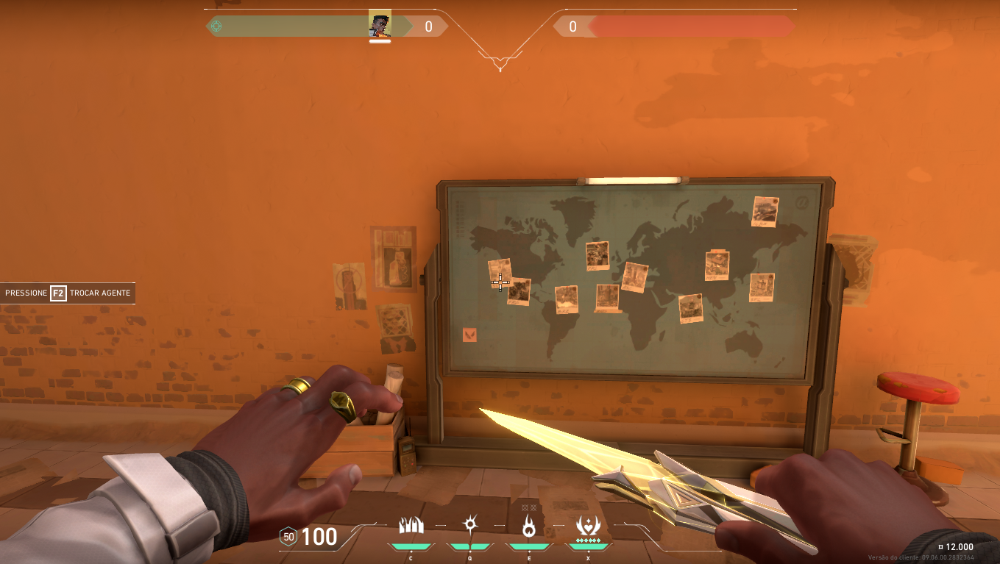
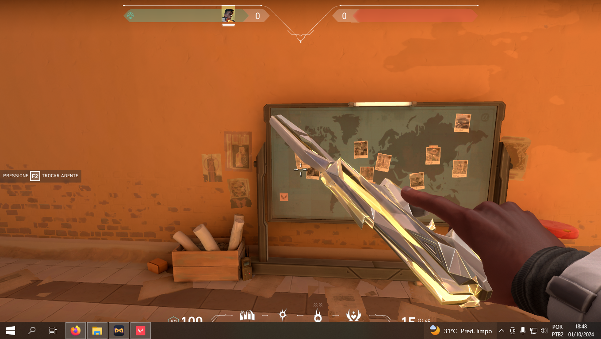

# VALORANT SKINCHANGER

**ATENÇÃO:** Esta versão disponível no GitHub está desatualizada e deve ser usada por sua conta e risco. Caso deseje ter acesso à minha build privada com injetor próprio e DLLs atualizadas, entre em contato pelo meu e-mail: **rubi_dev@vendacheats.com** ou acesse o site: [chat.vendacheats.com](https://chat.vendacheats.com)

Esta ferramenta permite trocar skins de armas no jogo Valorant de forma visual, com injeção de DLL e um sistema simples de uso. O **SkinChanger** oferece uma interface simplificada, feita para quem deseja personalizar a experiência no jogo sem complicações.

## Como configurar:

**PASSO 1:** Abra o Valorant!

**PASSO 2:** No CMD, execute o seguinte comando:

hookloader.exe SkinChanger.dll

**OU** simplesmente arraste o arquivo `Brazilian.dll` para o `hookloader.exe`.

## Vídeo Demonstrativo:
Confira o vídeo explicativo que mostra como usar o **SkinChanger** na prática. O vídeo está disponível na pasta `Resources`.

## Novos Pacotes Disponíveis:
Com meu SkinChanger privado, você pode liberar novos pacotes de skins diretamente da loja, gratuitamente!

## Contato:
Para mais informações ou dúvidas sobre o uso da ferramenta, envie um e-mail para **rubi_dev@vendacheats.com** ou acesse o site: [chat.vendacheats.com](https://chat.vendacheats.com)

---

**Disclaimer:** Este projeto é para fins educacionais. O uso de software de terceiros para modificar jogos é contra os Termos de Serviço da Riot Games e pode resultar em sanções na sua conta de jogo. Use por sua conta e risco.
